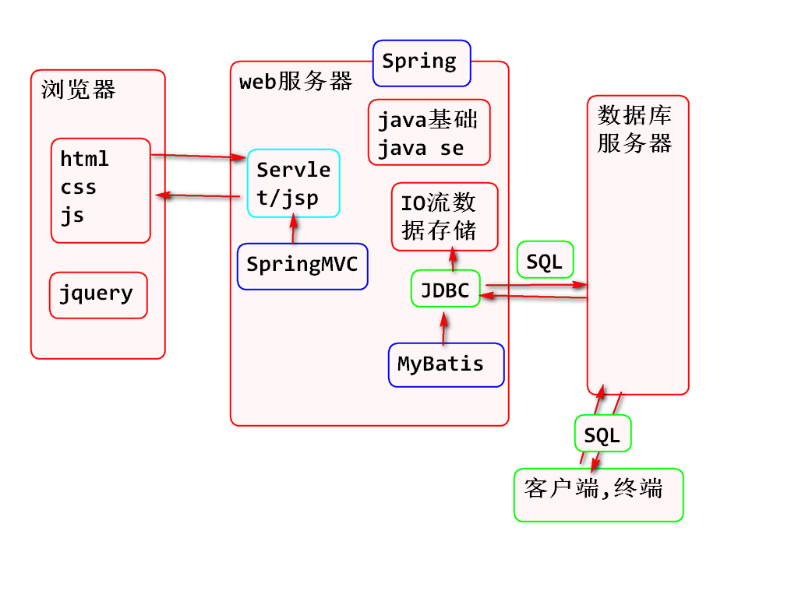

课程介绍：



## 数据库的应用场景：

- 咨询类型网站:存新闻,存评论,存用户信息
- 电商类:商品,订单,用户信息
- 社交类:微博,用户信息,用户微博信息,评论信息

## IO流文件存储的弊端：

1. 效率低（开发效率低，执行效率低）。
2. 数据的增删改查非常麻烦。
3. 只能保存少量数据。
4. 只能存储文本数据。 

## 什么是DB？

DataBase：数据库，数据库实际上就是一个文件集合。本质就是一个文件系统，数据按照特定的格式存储到文件中，使用SQL语言对数据进行增删改查操作。

## 什么是DBMS？

DataBaseManagementSystem：数据库管理系统，管理数据库文件的软件。

- 指一种操作和管理数据库的大型软件，用于建立使用和维护数据库，对数据进行统一的管理和控制，用户通过DBMS访问数据库中的数据。
- 常见：mysql  、 oracle 、db2 、 sqlserver 、 sqlite......

## 数据库的分类：

- 关系型数据库：经过数学理论验证，可以将现实生活中存在的各种关系，保存到数据库中，这种数据库成为关系型数据库,在此数据库中，以表的形式保存数据之间的关系。
- 非关系型数据库：主要为了解决特定的应用场景，如：缓存、高并发访问等......，存储数据的方式有很多种，redis是常见的非关系型数据库,redis是以键值对的形式保存数据。

## 常见数据库介绍：

- MySQL：08年被Sun公司收购，09年Sun公司被Oracle收购，开源。被Oracle收购后出了5.5版本由于使用了Oracle核心技术，性能有了大幅提高，导致Oracle用户流失，公司决定将MySQL闭源。导致MySQL程序员离开并创建了MariaDB。 

  > 市场占用最高

- Oracle：属于Oracle公司，性能最强大的数据库，而且收费非常高昂，适合不缺钱却缺技术的公司会选用。

  > 市场占用第二

- DB2：属于IBM公司，闭源收费，通常一些银行项目会使用。

- SQL server：属于微软公司，闭源收费，提供整套解决方案（web服务器、操作系统、数据库服务器等）。

  > 市场占用第三

- sqlite：轻量级数据库，应用在嵌入式或义动设备中使用，大小只有几十K，功能和性能较大型数据库要少很多。

## 开源和闭源的解释：

- 开源：公开源代码，免费，大牛程序员会维护和升级。
  > 弊端 ：通过卖服务赚钱，来钱比较慢。

- 闭源：不公开源代码，收费（卖产品）。

  > 弊端：大牛程序员会攻击找漏洞。

## 什么是数据库服务器：
-  服务器：一台高配置电脑
-  FTP服务器：安装了FTP服务软件提供了FTP服务功能的高配置电脑。
-  邮件服务器：安装了邮件服务的软件，提供了邮件服务功能的高配置电脑。
-  数据库服务器：安装了数据库服务的软件，提供了数据服务功能的高配置电脑。
-  web服务器：安装了web服务软件的高配置电脑。

## 连接数据库：

- 打开终端或命令行：在终端中输入以下命令< mysql -uroot -p>然后敲回车，输入密码再回车。

## 什么是SQL：

Stuctured Query Language：结构化查询语言，使用SQL语言和数据库服务器进行交互，通过SQL告诉数据库服务器对数据进行什么操作。

## SQL语句规范：

- 以 ;(分号) 结尾。
- 关键之间有空格，通常只有一个，但多个也可以。
- 可以存在换行。
- 数据库名称和表名称区分大小写。

## SQL数据库相关的SQL：

- 每一个工程对应一个数据库，存储数据需要先创建一个数据库，然后在数据库中创建表。

```
1.查看数据库：  show databases;
2.创建数据库：  create database 数据库名称; 
3.查看指定数据库详情： show create database 数据库名称;
4.指定字符集： create database 数据库名称 set 字符集(gbk)；
5.删除数据库：drop database 数据库名称；
6.选中(使用)数据库：use 数据库名称；
```

## 表相关的SQL语句：

- 什么是表：表是关系型数据库存储数据的单位，数据库中存储数据需要先创建表，往表中存储数据。
- 执行表相关的sql时一定要先选择数据库

```
1.创建表：
- 格式： create table 表名（字段1名 字段1类型，字段2名 字段2类型，字段n名 字段n类型）

2.查看所有表：
- 格式： show tables;

3.查看指定表详情 和表的字段信息：
- 格式： show create table 表名；
- 格式： desc 表明；

4.创建表指定引擎和字符集：
- 格式： create table 表名（id int,age int）engine=myisam charset=gbk;

5.删除表：
- 格式： drop table 表名；
```

- 创建表sql语句的执行过程: 在终端中写完sql语句后敲回车终端会把sql通过网络传输到DBMS(mysql),DBMS对sql语句进行解析,然后对数据库中的数据进行操作

## 表的引擎：

1. innodb：支持数据库的高级操作，包括：事务、外键...等等。
2. myisam：仅支持数据的增删改查操作。

## 表的修改：

```
1.修改表的名称：
- 格式：rename table 原名称 to 新名称;

2.修改表的引擎和字符集：
- 格式：alter table 表名 engine = myisam charset = gbk;

3.添加表的字段：
- (最后面追加)格式：alter table 表名 add 字段名 字段类型;
- (最前面添加)格式：alter table 表名 add 字段名 字段类型 first;
- (某个字段后边插入)格式： alter table 表名 add 字段名 字段类型 after 字段名；

4.删除字段：
- 格式： alter table 表名 drop字段名；

5.修改字段名称和类型：
- 格式：alter table 表名 change 原字段名 新字段名 字段类型;

6.修改字段的类型和位置：
-格式：alter table 表名 modify 字段名 字段类型 first/after 字段名；
```

## 数据相关的SQL语句：

一、插入数据：

```
1.全表插入：要求插入的数据的数量和顺序要和表字段的数量顺序一致。 
- 格式：insert into 表名 values(值1，值2.....值n)，(值1，值2.....值n);  【可批量插入】
  实例: insert into t_stu values(1,'张三',23);
  
2.指定字段插入：  
- 格式：insert into 表名 (id,name) values(2,'lisi')

3.查询数据： 
- 格式：select * from 表名；                            【查询所有】
- 格式：select 值1(id),(name)值2 from 表名;			【查询指定】

4.修改数据：
- 格式：update 表名 set 字段名 = 值 where 字段名 = 值；
- 实例：update t_stu set name='卷帘大将',age=200 where id=5;

5.删除数据：
- 格式：delete from 表名 where 字段名=值;
- 实例：delete from t_stu where name='八戒';
```

## windows电脑出现命令行中无法插入中文数据的解决方案：

- 在命令行中先登陆mysql、然后执行set names gbk;
- 这样做是通知MySQL数据库服务器，客户端（命令行）的编码格式为GBK；

